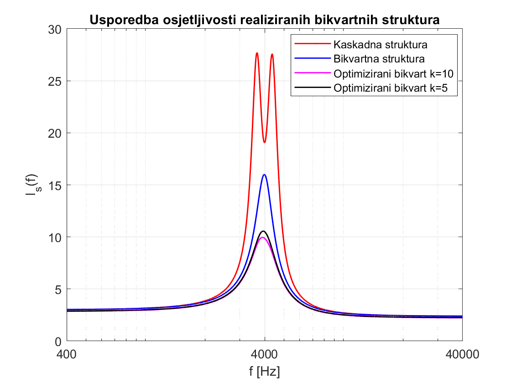
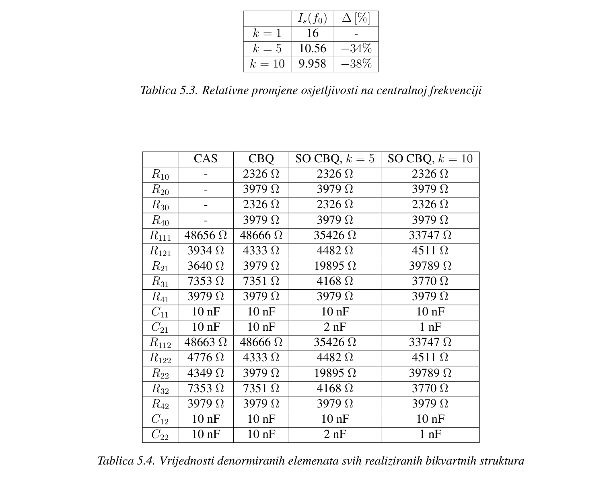

# Sensitivity Optimization of a 4th-Order Chebyshev Bandpass Filter in CBQ Structure

This project focuses on analyzing and minimizing the sensitivity of a fourth-order Chebyshev bandpass filter implemented in a *Cascade of Biquadratic (CBQ)* structure.  
This work is also my Master's thesis in Electrical Engineering.

The goal is to reduce the impact of real-world component tolerances (resistor and capacitor variations) on the filter's key performance metrics, such as center frequency, quality factor (Q), and gain.

Key features:
- Analog filter design targeting a central frequency of 4 kHz
- Analytical derivation of sensitivity functions with respect to passive components
- MATLAB simulations of:
  - Frequency response
  - Sensitivity analysis
  - Sensitivity optimization
- Modified filter design using optimized resistor and capacitor values
- Comparison of sensitivity between optimized and non-optimized CBQ implementations (cascade structure, CBQ structure, and optimized CBQ structure)
- Validation of all filter designs using LTSpice simulations, including Monte Carlo tolerance analysis
- Laboratory breadboard implementation and oscilloscope validation of frequency response (sensitivity measurements not feasible in hardware)

Tools used:
- MATLAB
- LT Spice
- Electronic components and breadboard setup
- Oscilloscope

--------------------------------------------------------------------------------------------------------------------------------------------------------------------------------------------------------------------

For sensitivity analysis, Schoeffler sensitivity and multiparameter sensitivity were recorded. The obtained optimization results are shown below, as well as the table with filter element values for all optimized structures. Two cases of optimization are shown - one where the ratio between element values is 10 which could potentially cause some undesired effects such as voltage imbalance, more pronounced current noise effects..., and another where the ratio is 5, obtained by examination of the rate of change of multiparameter sensitivity with respect to ratio where it was concluded that with the half of ratio the sensitivity increased by only 6%.

The following table shows the decrease in sensitivity for both optimization cases. As seen, with half the ratio *k*, the decrease in sensitivity was only 4% less than with *k=10*. Additionally, values for resistors and capacitors for cascade structure, feedback structure, and optimized feedback structures are shown.

Author:
Leonard Mikša,
MSc Electrical Engineering student,  
Email: [leonardmiksa@gmail.com](mailto:leonardmiksa@gmail.com)

> *This repository is currently under active development as part of my Master's thesis project.*
